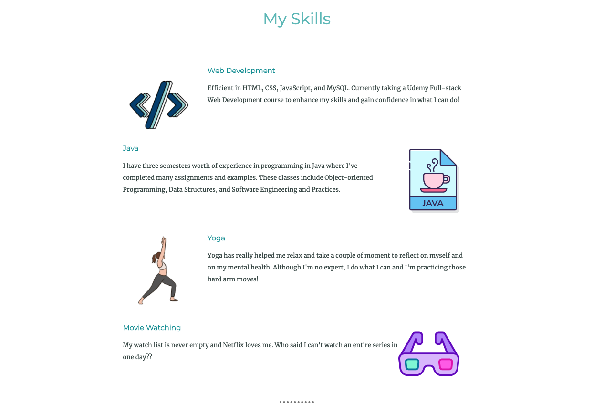

# About Me Site
A small introduction of myself and what I enjoy! 
I used HTML5 and CSS3 to create this website. 

## To view:
* Download all files
* Open index.html in a web browser

## Screenshots

